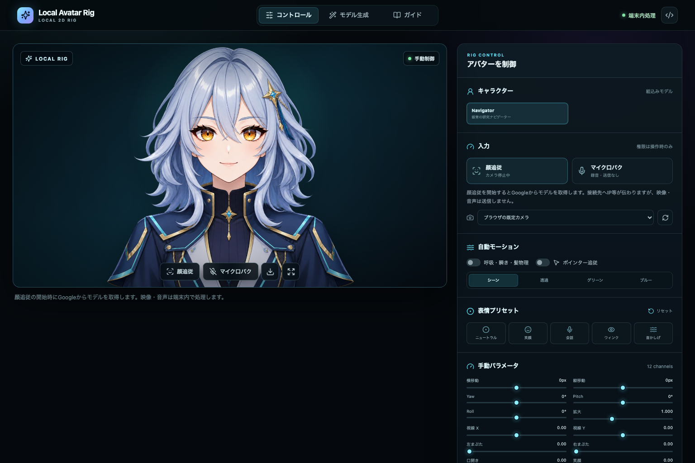

# Local Avatar Rig

ブラウザだけで動く、ローカル優先の軽量2Dアバター・リグです。3枚の透過PNGを
WebGLメッシュで変形し、手動パラメータ、カメラによる顔追従、マイク音量による
口パク、PNG書き出しを提供します。



## 特徴

- Neutral・Blink・Mouth-openの3状態を使う独自WebGLメッシュ描画
- 頭・首・胸・両肩の関節に沿って、顔の形と首の長さを保つ変形
- Yaw / Pitch / Roll、左右まぶた、視線、口、笑顔の手動制御
- 明示操作で開始するカメラ顔追従とマイク口パク
- 透過、グリーン、ブルー、コード生成シーン背景
- 独自PNGの寸法・透過・ハッシュ確認とプレビュー適用
- 取り込んだ3枚から目・口と5関節を端末内で推定し、画像上で調整
- カメラ映像・マイク音声・読込画像をアプリのサーバーへ送信しない設計

この実装は軽量なブラウザ用プレビューリグです。階層化された制作素材、物理設定、
または特定ベンダーの専用モデル形式を生成するものではありません。

## 必要環境

- Node.js `^20.19.0` または `>=22.12.0`
- pnpm `11.19.0`
- WebGLとWeb Workerに対応した現行ブラウザ
- 顔追従を使う場合は `localhost` またはHTTPS

## 起動

```bash
corepack enable
pnpm install --frozen-lockfile
pnpm dev
```

表示された `http://127.0.0.1:4173` を開いてください。カメラとマイクは、対応する
開始ボタンを押すまで使用されません。

厳格なCSPを開発時にも維持するため、自動差分更新（HMR）は無効です。
ソースを編集した後はブラウザを再読み込みしてください。

## 顔追従モデルの取得

顔追従モデルはリポジトリにもビルド成果物にも同梱していません。利用者が
「顔追従」を開始したときだけ、次の固定URLから取得します。

- URL: `https://storage.googleapis.com/mediapipe-models/face_landmarker/face_landmarker/float16/1/face_landmarker.task`
- Size: `3,758,596 bytes`
- SHA-256: `64184e229b263107bc2b804c6625db1341ff2bb731874b0bcc2fe6544e0bc9ff`

Workerはリダイレクトを拒否し、URL・サイズ・SHA-256がすべて一致した場合だけモデルを
初期化します。この取得ではホスティング事業者へIPアドレス等の通常の接続情報が
伝わり得ます。カメラ画像はモデル取得リクエストに含めず、検証後の推論も端末内です。
詳しくは[プライバシー説明](docs/privacy.md)をご覧ください。

検出が短く途切れた場合は300msまで直前の姿勢を保持し、その後は滑らかに正面へ戻ります。
再検出しても正面の基準は変わりません。基準を取り直す場合は一度停止して再開してください。

## 組込みアバター

公開版には、生成経路と利用条件を記載した `Default Navigator` だけを同梱しています。

| 状態 | ファイル | SHA-256 |
| --- | --- | --- |
| Neutral | `public/assets/vtuber-rig-default-neutral-v1.png` | `48629bb48a253325e599b9356fa13782c0f1b5a4f148c107756e42360e86c74f` |
| Blink | `public/assets/vtuber-rig-default-blink-v1.png` | `9ebb6b2488a1ee537dbe9bf58be125496d44d251b773799da2bb8b714a2c117b` |
| Mouth-open | `public/assets/vtuber-rig-default-mouth-open-v1.png` | `56cd42e688fb6b4f82855875b0738ab745c176f5ae24a9628b3e9d543cd42de6` |

固定値と来歴は
[`default-navigator-v1.manifest.json`](public/assets/default-navigator-v1.manifest.json)、
設計・受入記録は
[`docs/design/default-navigator-v1.md`](docs/design/default-navigator-v1.md)にあります。

## 独自モデル

「モデル生成」画面は画像生成APIを自動実行しません。プロンプトを作り、利用者が用意した
PNGをブラウザ内で検査します。3状態には次を要求します。

- 同一の16:9キャンバス、同じ人物位置と輪郭
- 実際の透明アルファ（描画された市松模様は不可）
- Blinkは目、Mouth-openは口以外を変えない
- 1ファイル20MB以下、最大4096px、合計1,000万画素以下

3枚が検査を通ると、表情差分と透明輪郭から目・口・頭の付け根・首の根元・肩・胸を
端末内で推定します。画像上で頭の付け根があごの下、首の根元が襟元にあることを確認し、
必要なら点をドラッグして調整してください。画像と調整値は同時にプレビューへ適用され、
推定根拠と調整値はManifestへ保存できます。差分がない、位置がずれている、あごや首が
隠れている画像では確度を下げて仮配置を示します。1枚の画像を変形するリグであるため、
大きな横顔や隠れた首・髪を新たに描き出すことはできません。

読込画像はBlob URLとして端末内で扱い、外部APIへアップロードしません。持込画像と
その調整はセッション内の一時状態で、再読み込みで消えます。利用者は、
読み込む画像、人物、商標その他の権利を確認してください。
任意の背景PNGも同じ手順で持ち込めます。背景の指定がなければコード生成のシーンを使います。

## 検証

```bash
pnpm check
pnpm test:browser
LOCAL_AVATAR_RIG_TEST_BUILD=1 pnpm test:browser
pnpm security:audit
```

画面証拠を再生成する場合は、別ターミナルで開発サーバーを起動してから実行します。

```bash
LOCAL_AVATAR_RIG_CAPTURE_URL=http://127.0.0.1:4173 pnpm capture:default
```

検証内容と既知の境界は[`docs/validation.md`](docs/validation.md)にまとめています。

## セキュリティとプライバシー

- Content Security Policyで実行元を制限
- Workerの外部通信を固定モデルURL1件に限定
- モデルはサイズとSHA-256を検証し、不一致時は停止
- カメラ・マイクは明示操作時だけ取得し、停止時にトラックを解放
- 顔推論をWorkerへ隔離し、カメラフレームを外部へ送信しない
- 外部スクリプト、解析タグ、広告、遠隔APIを同梱しない
- npm公開事故を防ぐため`package.json`は`private: true`

脆弱性報告には、再現条件と影響範囲を添えてGitHubのSecurity advisory機能をご利用ください。
認証情報や個人データを公開Issueへ投稿しないでください。

Webサイトとして配布する場合は、`public/_headers`に対応するホスト、または同等の
HTTPヘッダー設定を使ってください。Workerの応答にもCSPが必要です。

## ライセンス

- ソースコード: [MIT License](LICENSE)
- 組込みキャラクター画像と本リポジトリの画面画像:
  [ASSET_LICENSE.md](ASSET_LICENSE.md)の限定ライセンス
- 第三者ソフトウェアと商標表示:
  [THIRD_PARTY_NOTICES.md](THIRD_PARTY_NOTICES.md)

リポジトリ全体がMITであるという意味ではありません。とくに組込み画像を単体の素材集、
別ブランド、商品、学習データとして再利用する権利は付与されません。

## 文書

- [アーキテクチャ](docs/architecture.md)
- [モデル生成手順](docs/model-generation.md)
- [モーション比較](docs/motion-comparison.md)
- [プライバシー説明](docs/privacy.md)
- [検証記録](docs/validation.md)

## 開発方針

この公開リポジトリは、公開可能なファイルだけから作った独立した履歴を使用しています。
公開物へ秘密情報、社内運用記録、第三者映像・音声・サムネイルを含めない方針です。
