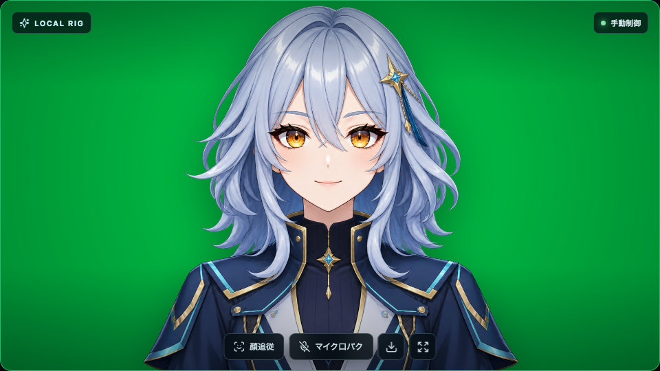
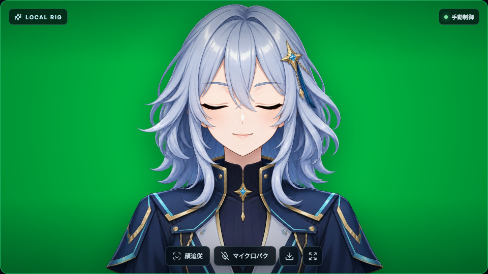
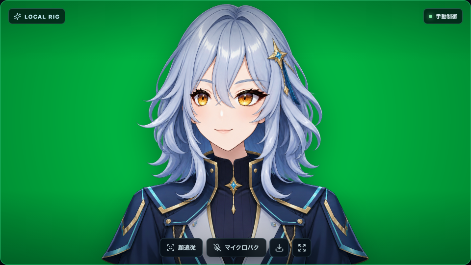
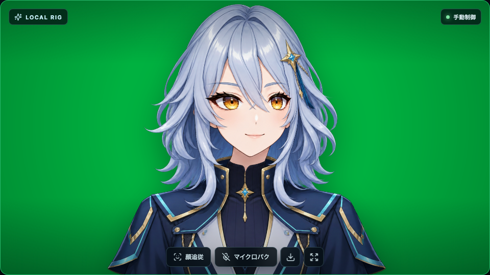
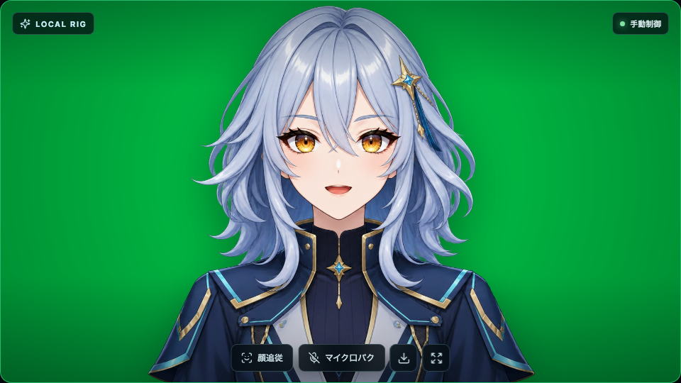

# 固定状態によるモーション確認

最終更新: 2026-09-10（Asia/Tokyo）

Default Navigatorを同じ条件で撮影し、表情と顔向きの変化を比較するための記録です。
掲載対象は本アプリの表示だけです。静止画は状態ごとの描画を示しますが、瞬きの速度、
音声への応答、髪の収束など時間に依存する品質は実際の連続動作でも確認します。

## 固定撮影条件

- viewport: 1536×1024、device scale factor: 1
- 出力: `.avatar-stage`を960×540のPNGとして撮影
- 自動モーション、ポインター追従: OFF
- 顔追従、マイク: 未開始
- 背景: グリーン
- 各状態の設定前にNeutralへリセット

| 状態 | 設定 | 見る点 |
| --- | --- | --- |
| Neutral | リセット直後 | 髪、肩、衣装の輪郭と透明な縁 |
| Blink | 左右まぶた1.00 | 両目が閉じ、目以外が動かないこと |
| Yaw left | Yaw −24° | 顔内部と輪郭の位置関係、髪や首のつながり、襟と肩の固定 |
| Yaw right | Yaw +24° | 反対方向でも破綻が生じないこと |
| Speaking | 口開き0.72、笑顔0.20 | 口の二重線、パッチの境界、顎の連動 |

Yaw、Pitch、Rollでは、首の長さが変わらないこと、頭の付け根より下の襟・肩・胸が
動かないこと、髪が反転しないことも合わせて確認します。

## 画像

| Neutral | Blink |
| --- | --- |
|  |  |

| Yaw −24° | Yaw +24° |
| --- | --- |
|  |  |



## 連続動作の確認

自動モーションを有効にして、短い閉眼から自然に開くこと、頭、肩、髪が安定した遅れで
追従することを確認します。無効にしたときは、髪の揺れが残り続けないことを確認します。
マイク使用時は、無音で口が閉じ、入力音量に応じて連続的に開くことを確認します。
さらに、表示中のアバターと背景がPNG保存にも含まれることを確認します。

このリグは3枚のPNGを使います。大きな横向きでの描き足し、多層パーツ、母音別の口形を
持たないため、その範囲は表現できません。関節位置は画像から推定した近似で、髪や衣装で
隠れた首の根元、肩、胸は特に確認が必要です。動作確認では、現在の画像と変形範囲で
不自然な境界や破綻が発生していないかを評価します。

## 再撮影

ローカルサーバーを起動し、別のターミナルから実行します。

```bash
pnpm exec vite --host 127.0.0.1 --port 4173 --strictPort
```

```bash
LOCAL_AVATAR_RIG_CAPTURE_URL=http://127.0.0.1:4173 pnpm capture:default
```

撮影スクリプトは5状態に加え、デスクトップ、モバイル、モデル生成画面も保存します。
対象の版と最終的な合格結果は[検証手順・記録](validation.md)に記載します。
